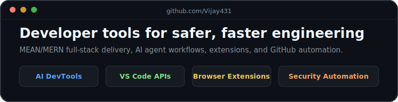

# Vijay Gangatharan

**Specialist Programmer at Infosys | MEAN/MERN engineer building AI devtools, VS Code extensions, browser extensions, and GitHub automation**

[LinkedIn](https://www.linkedin.com/in/vijay-gangatharan/) ·
[Stack Overflow](https://stackoverflow.com/users/14218772/vijay-gangatharan) ·
[Dev.to](https://dev.to/vijay431) ·
[Medium](https://medium.com/@vijay_gangatharan)

## Focus

I build developer-facing tools that make daily engineering work calmer, safer, and easier to repeat. My current work sits around:

- Full-stack product engineering with Angular, React, Node.js, Express, NestJS, MongoDB, PostgreSQL, and Redis.
- AI-assisted repository maintenance, security automation, OpenRouter/LLM workflows, and agentic developer tooling.
- VS Code and browser extensions for workflow shortcuts, screencasts, YouTube productivity, and repo hygiene.
- GitHub Actions, Dependabot, release automation, branch protection, and open-source community maintenance.

At Infosys, I work as a Specialist Programmer and have contributed to production platforms including aviation and UAV insurance workflows. I have also received two Infosys Insta Awards for peer and manager recognition.

## Flagship Projects

| Project | What it does | Stack |
| :--- | :--- | :--- |
| [seccure](https://github.com/Vijay431/seccure) | AI agent that reviews Dependabot security PRs, reasons about manifests and lockfiles, and prepares safe remediation workflows. | Python, GitHub Actions, OpenRouter, supply-chain security |
| [Orkestra](https://github.com/Vijay431/Orkestra) | Local Jira-style project management system exposed through MCP so AI agents can inspect, plan, and update project state. | Go, SQLite, Docker, MCP |
| [yt-autolike](https://github.com/Vijay431/yt-autolike) | Privacy-first browser extension that can automatically like YouTube videos and Shorts for trusted channels. | TypeScript, React, browser extension APIs |
| [additional-context-menus](https://github.com/Vijay431/additional-context-menus) | VS Code extension with practical right-click actions for refactoring, navigation, and repeated code tasks. | TypeScript, VS Code API, AST tooling |
| [keypress-notifications](https://github.com/Vijay431/keypress-notifications) | VS Code extension that displays keypresses for tutorials, demos, screencasts, and pair-programming sessions. | TypeScript, VS Code API |
| [vscode-extension-template](https://github.com/Vijay431/vscode-extension-template) | Production-ready starter for VS Code extensions with builds, linting, packaging, and release automation wired in. | TypeScript, esbuild, GitHub Actions |

## Technical Toolbox

| Area | Tools |
| :--- | :--- |
| Frontend | Angular, React, Next.js, TypeScript, JavaScript, Sass, Tailwind CSS, Angular Material, Redux, Zustand |
| Backend | Node.js, Express, NestJS, REST APIs, auth workflows, MongoDB, MySQL, PostgreSQL, Redis |
| AI and agents | OpenRouter, GitHub Copilot, Codex, Claude Code, Gemini, MCP, LangChain, n8n automation |
| DevTools | VS Code API, browser extensions, GitHub Actions, Dependabot, CodeQL, Docker, Terraform, OpenVSX, VSCE |
| Cloud and delivery | AWS, Vercel, Netlify, Supabase, npm, pnpm, Bun, release automation |

## Certifications

- AWS Certified Cloud Practitioner, issued Apr 2025, expires Apr 2028.
- AWS Certified AI Practitioner, issued Apr 2026, expires Apr 2029.
- GitHub Foundations, issued Nov 2025, expires Nov 2027.
- GitHub Copilot, issued Feb 2026, expires Feb 2028.
- MongoDB courses across RAG apps, vector search, AI agents, aggregation, indexing, schema design, and sharding.

Verification links are available on my [LinkedIn profile](https://www.linkedin.com/in/vijay-gangatharan/).

## Open Source Direction

I am especially interested in tools that make AI-heavy repositories easier to maintain: explicit repo contracts, safer generated-file boundaries, repeatable security checks, and better handoff between humans and coding agents.

One proposal I am exploring publicly: [a `.gitallow` allowlist for AI-generated repo artifacts](https://github.com/orgs/community/discussions/200163), intended to reduce accidental commits of temporary agent files and internal development context.

## Contact

I am based in India and open to collaboration around developer tools, VS Code extensions, browser extensions, open-source automation, and AI-assisted maintenance workflows.

- Email: `vijayanand431@gmail.com`
- LinkedIn: [vijay-gangatharan](https://www.linkedin.com/in/vijay-gangatharan/)
- Stack Overflow: [vijay-gangatharan](https://stackoverflow.com/users/14218772/vijay-gangatharan)
