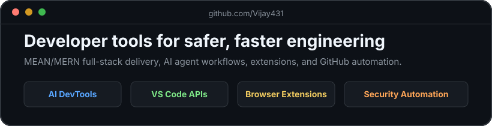

# Vijay Gangatharan

Specialist Programmer at Infosys · MEAN/MERN · Bengaluru

## About

I am Vijay Gangatharan, a specialist programmer at Infosys in Bengaluru. On GitHub I build developer tools in TypeScript: VS Code extensions and a browser extension that take small pieces of daily friction out of the editor and the browser. Public work includes context-aware right-click menus, on-screen keypress overlays for demos, a local YouTube auto-like extension, and a template for shipping VS Code extensions. I also compete in HackerRank Orchestrate; the September 2026 affordability agent finished bronze, top 8%.

## GitHub

## Projects

- [additional-context-menus](https://github.com/Vijay431/additional-context-menus) — VS Code extension with context-aware right-click menus for refactoring, navigation, and common editor actions. TypeScript.
- [keypress-notifications](https://github.com/Vijay431/keypress-notifications) — VS Code extension that shows on-screen keypress overlays for screencasts, live demos, tutorials, and pair programming. TypeScript.
- [yt-autolike](https://github.com/Vijay431/yt-autolike) — Privacy-first browser extension that likes YouTube videos and Shorts for channels you choose. Runs locally. TypeScript.
- [vscode-extension-template](https://github.com/Vijay431/vscode-extension-template) — Template for VS Code extensions with TypeScript, esbuild, ESLint, and CI.

## Hackathons

- [hackerrank-orchestrate-august26](https://github.com/Vijay431/hackerrank-orchestrate-august26) — August 2026, ranked 952 of 1,983. Routes WhatsApp messages to notify, digest, or mute, using an LLM and local retrieval over text, images, and voice notes. Python.
- [hackerrank-orchestrate-september26](https://github.com/Vijay431/hackerrank-orchestrate-september26) — September 2026, bronze, 232 of 3,062 (top 8%). Decides whether a requested expense is safe to pay now, pay later, split, or decline. Python.

## Open source

I am interested in tools that make AI-heavy repositories easier to keep: explicit repo contracts, safer boundaries for generated files, and a cleaner handoff between people and coding agents.

One public proposal: [a `.gitallow` allowlist for AI-generated repo artifacts](https://github.com/orgs/community/discussions/200163).
