<div align="center">

<!-- Animated Header -->


<!-- Typing Animation -->


<!-- Visitor Counter -->


</div>

---

## 🚀 About Me

```yaml
name: "Vijay"
role: "Full Stack Developer"
location: "India"
currently_working_on: "Building innovative web solutions"
learning: "Advanced system design and cloud architecture"
fun_fact: "I debug with print statements and I'm not ashamed!"
available_for: "Freelance projects and collaboration"
```

## 💻 Tech Stack & Expertise

### 🎨 Frontend Technologies


### ⚙️ Backend Technologies


### 🗄️ Databases


### ☁️ Cloud & DevOps


### 🛠️ Tools & Others


<!-- Future Tech Stack Placeholder -->
### 🔮 Currently Exploring
>
> *This section will be automatically updated as I learn new technologies*

- **Coming Soon:** Advanced system design patterns
- **Next Goal:** Cloud-native architectures  
- **Investigating:** AI/ML integration in web apps

## 🎯 Featured Projects

<div align="center">

| Project | Description | Tech Stack | Status |
|---------|-------------|------------|---------|
| 🚀 **Coming Soon** | Exciting projects in development | React, Node.js, MongoDB | 🔨 In Progress |
| 💡 **Your Next Project** | Open for collaboration | TBD | 💭 Planning |
| 🌟 **Innovation Hub** | Experimental features | Latest Tech | 🧪 Research |

> *This section will showcase live projects with demos and GitHub links*

</div>

---

## 📈 Contribution Activity

<div align="center">

### 🏆 GitHub Achievements


### 📊 GitHub Analytics


### 🔥 GitHub Streak


### 📊 Weekly Development Breakdown
<!--START_SECTION:waka-->
<!-- This section will be auto-updated with WakaTime stats -->
*Connect WakaTime for detailed coding statistics*
<!--END_SECTION:waka-->

</div>

---

## 🌐 Open Source Contributions

<div align="center">

### 🎯 Contribution Highlights
>
> *Future showcase for Pull Requests, Issues, and Repository contributions*

| Metric | Count | Description |
|--------|-------|-------------|
| 🔄 **Pull Requests** | `Coming Soon` | Contributions to open source projects |
| 🐛 **Issues Opened** | `Coming Soon` | Bug reports and feature requests |
| ⭐ **Stars Earned** | `Coming Soon` | Recognition from the community |
| 🍴 **Repositories Forked** | `Coming Soon` | Projects I've contributed to |

### 🏷️ Hacktoberfest Contributions

*Placeholder for annual open source contribution events*

</div>

---

## 🤝 Developer Community Engagement

<div align="center">

### 📝 Recent Articles & Posts
>
> *This will automatically sync with your latest content*

| Platform | Latest Activity | Engagement |
|----------|----------------|------------|
| 📖 **Dev.to** | `Placeholder for latest article` | 👥 `Coming Soon` |
| ✍️ **Medium** | `Placeholder for latest post` | 👏 `Coming Soon` |
| 🐦 **Twitter** | `Latest tech thoughts` | 🔄 `Coming Soon` |
| 💼 **LinkedIn** | `Professional updates` | 👔 `Coming Soon` |

### 🎤 Speaking & Community
>
> *Future showcase for conference talks and community involvement*

</div>

---

## 🏅 Stack Overflow Contributions

<div align="center">

### 📚 Knowledge Sharing
>
> *This section will display your Stack Overflow activity*

| Metric | Value | Badge |
|--------|-------|-------|
| 🆠**Reputation** | `Coming Soon` |  |
| ❓ **Questions Answered** | `Coming Soon` | 🎯 Helping developers |
| ✅ **Accepted Answers** | `Coming Soon` | 💡 Problem Solver |
| 🔍 **Questions Asked** | `Coming Soon` | 🤔 Curious Learner |

</div>

---

## 🚀 Learning Journey

<div align="center">

### 📚 Current Learning Path
>
> *Auto-updated based on recent commits and activities*

```mermaid
graph LR
    A[🎯 Current Focus] --> B[System Design]
    A --> C[Cloud Architecture]
    A --> D[AI/ML Integration]
    B --> E[Scalability Patterns]
    C --> F[Microservices]
    D --> G[LLM Applications]
```



### 🎓 Certifications & Achievements

*Placeholder for professional certifications and course completions*

| Certificate | Provider | Status | Date |
|-------------|----------|---------|------|
| 🏅 **AWS Solutions Architect** | Amazon | `In Progress` | 2025 |
| 🏅 **Advanced React Patterns** | Various | `Planned` | 2025 |
| 🏅 **System Design Mastery** | Various | `Exploring` | 2025 |

</div>

---

## 🤝 Collaboration & Projects

<div align="center">

### 🚀 Looking to Collaborate On

- **Open Source Projects**: Contributing to impactful repositories
- **Startup Ideas**: Building the next big thing
- **Learning Projects**: Exploring new technologies together
- **Community Building**: Creating developer resources

### 🏆 Hackathons & Competitions

*Future showcase for competitive programming and hackathon achievements*

</div>

---

## 💡 Innovation Showcase

<div align="center">

### 🔬 Research & Experiments
>
> *Space for patents, research papers, or technical innovations*

| Innovation | Description | Status | Impact |
|------------|-------------|---------|---------|
| 🧪 **Coming Soon** | Experimental projects | `Research Phase` | 🌟 High Potential |
| 🔍 **Tech Research** | Emerging technologies | `Investigating` | 📈 Future Ready |

</div>

---

## 📬 Let's Connect & Collaborate

<div align="center">

### 🌟 Ready to Build Something Amazing Together?


### 🔗 Social Links

[](https://your-portfolio.com)
[](https://linkedin.com/in/your-profile)
[](https://twitter.com/your-handle)
[](https://dev.to/your-profile)
[](https://medium.com/@your-profile)
[](https://stackoverflow.com/users/your-id)

### 📧 Get In Touch

```javascript
const contact = {
    email: "your.email@example.com",
    discord: "YourHandle#0000",
    availability: "Open for opportunities",
    responseTime: "Usually within 24 hours",
    preferredTopics: [
        "Web Development", 
        "System Design", 
        "Open Source", 
        "Tech Discussions"
    ]
}
```

### 💝 Support My Work

If you find my projects helpful, consider:

[](https://buymeacoffee.com/your-profile)
[](https://ko-fi.com/your-profile)
[](https://github.com/sponsors/Vijay431)

### ✍️ Random Dev Quote


---

<div align="center">
  
### 🚀 "Code is like humor. When you have to explain it, it's bad." - Cory House

**Thanks for visiting! Let's build the future together** 🌟


</div>

---

<details>
<summary>📊 <b>Profile Analytics & Insights</b></summary>

<br>

### 🔍 Profile Metadata

- **Profile Created**: Dynamic timeline coming soon
- **Last Updated**: Auto-updated via GitHub Actions
- **Profile Views**: Updated in real-time
- **Total Repositories**: Synced with GitHub API
- **Active Projects**: Based on recent commits

### 🎯 Future Enhancements

- [ ] Real-time coding statistics integration
- [ ] Automated blog post synchronization  
- [ ] Live project status dashboard
- [ ] Interactive skill assessment
- [ ] Community contribution tracker
- [ ] MCP tool integrations for dynamic content

### 🛠️ Profile Tech Stack

Built with: `Markdown` `GitHub APIs` `Vercel Widgets` `GitHub Actions`

*This profile is continuously evolving with new features and automations!*

</details>
